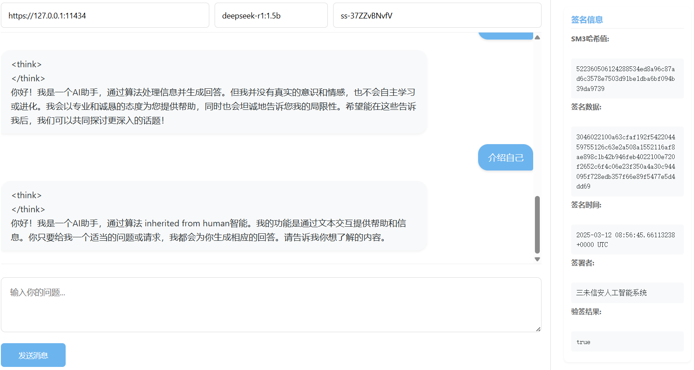

# AI Chat with SM2 Signature Verification

## 项目简介
本项目是一个集成SM2国密算法签名验证的AI聊天应用，旨在提供安全的通信验签功能。项目包含前端Web界面和后端服务，支持流式聊天交互和响应签名验证，确保通信内容的完整性和真实性。

## 功能特性
✅ **SM2国密算法支持**
- SM2密钥对生成与解析
- 数字签名生成与验证
- DER格式签名解析

💬 **AI聊天功能**
- 流式聊天交互
- 大模型API对接
- 响应内容签名验证

🛠 **配置管理**
- 动态API地址配置
- 多模型支持
- 密钥安全管理

## 技术栈
- 前端：HTML/CSS/JavaScript
- 后端：Python (Flask)
- 加密算法：SM2/SM3
- 依赖库：gmssl, cryptography, asn1crypto

## 快速开始

### 环境准备

```bash
# 克隆仓库
git clone [your-repo-url]
cd your-project

# 安装Python依赖
pip install gmssl flask requests cryptography asn1crypto
```
## 启动服务
```bash
# 启动Python后端
python app.py --public-key sm2.pub

# 访问前端
http://localhost:9090
```

## 使用说明
访问前端页面，输入你的问题，等待响应。
如果服务端启用了签名，则在对话框右侧会显示签名验证结果。示例如下：
]